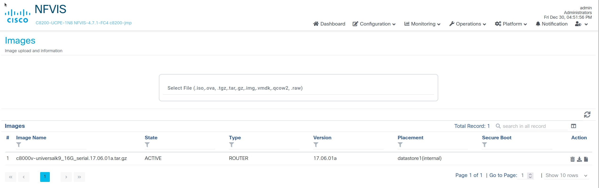

<!-- backgroundImage: url(images/blueteam1.png)-->

<h1> Présentation du Catalyst 8200 </h1>


---


<!-- backgroundImage: -->


## Network Functions Virtualization (NFV) 

- L'idée est de virtualiser des fonctions réseaux (Virtual Network Function = VNF ) des couches 4 à 7:  routeurs (comme un "route reflector" BGP) , pare-feux, équilibreurs de charges, antiddos... 
  comme l'a fait la virtualisation des systèmes par le passé. 
- Les avantages :  
  - la VNF est indépendante  du matériel sous jacent. Matériels qui peuvent être "on premises" ou dans le CLOUD et qui offre du CPU et de la mémoire en abondance.
  - On peut chaîner les VNF ensemble afin d'obtenir un super service. 
  - Les VNF sont liées au SDN (Software Defined Networking) qui peut piloter les flux vers le meilleurs services.
  - Technologies en phase avec le CLOUD avec transformation des coûts fixes (CAPEX) en (OPEX), et le paiement à la consommation. 
  
  
---
<!-- backgroundImage: -->


## NFVIS

Cisco a une infrastructure dédiée pour les  **VNF** qui s'appelle **NFVI** (**N**etwork **F**unction **V**irtualization **I**nfrastructure) et un **S**ystème qui permet de la piloter :  **NFVIS**.


---


<!-- backgroundImage: -->


### Catalyst 8200 définition "commerciale" par Cisco

<div style="text-align: left"> 

- Le système Cisco Catalyst 8200 Edge uCPE réunit des fonctions de _routage, de commutation, de stockage, de traitement_ et bien d'autres fonctions de calcul et de réseau dans une seule unité de rack compacte.
</div>

<div style="text-align: left"> 

- Le **Cisco Catalyst 8200** Edge uCPE prend en charge toutes ces fonctions en offrant une infrastructure pour le déploiement des fonctions de réseau virtualisées (NVF...), tout en agissant comme un serveur qui résout des problèmes de traitement, de workload et de stockage."
</div>

<div style="text-align: right"> 
source Cisco 
</div>

---

<!-- backgroundImage: -->


# En fait

C'est un **"<span style="color:red ">boitier de virtualisation"</span>** dont le système d'exploitation NFVIS basé sur Linux et son hyperviseur KVM. Dans les dernières versions de NFVIS, Kubernetes fait son apparition.


Quand vous vous connectez via le port console, vous êtes sous NFVIS 
et non pas dans l'OS d'un routeur !
(user **admin** password par défaut **Admin123#**)
---

<!-- backgroundImage: -->


## De l'open source sytèmes en dessous du Catalyst

Le catalyst 8200 s'appuie sur:

- Un OS RedHat ( 7.2 à la date du )
- OpenVswitch
- KVM , LibVirt, virsh ...

---
## Pour la partie réseaux Hardware 

<!-- backgroundImage: -->


- Les cartes réseaux du catalyst 8200 supportent **SRVIOV** et permettent de connecter directement la VM à une carte réseau virtuelle émulée par la NIC physique.
  SRIOV est bien adapté au trafic Nors Sud important ( VM vers Internet et vice versa)
- Le catalyst 8200 support DPDK 
  - DPDK permet de gérer les transferts du réseau en dehors de l'espace noyau (Kernel Space) donc sans le surcharger ni copier les paquets de l'espace utilisateur vers l'espace noyau.
  - On évite aussi l'interruption du CPU par la carte réseau d'ou le gain en performance à très haut débit.
  - DPDK nécessite du développement logiciel puisque la pile TCP/IP n'est pas utilisé.
    Heureusement OpenVswitch a déjà fait ce travail et est capable d'utiliser DPDK pour vous. 
  - DPDK est bien adapté au trafic Est-Ouest (échanges entre VM), mais il consommera du CPU et de la mémoire.

---

#### Bridge ou OpenVswitch sans accélération

<!-- backgroundImage: -->


---

#### OpenVswitch et DPDK

<!-- backgroundImage: -->


---


<!-- backgroundImage: -->


###### Interface WEB de NFVIS.


---

<!-- backgroundImage: -->


# C8200


---
<!-- backgroundImage: -->


###### Le réseau et le C8200


---

<!-- backgroundImage: -->


# C8200

- On définit des réseaux (wan-net, lan-net,mgmt-net...).
- Les réseaux sont reliés à des bridges (wan-br, lan-br,mgmt-br..).
- Les bridges sont reliés aux cartes réseaux physiques qui génèrent les "cartes SRIOV" auxquelles les VM peuvent se connecter directement (para-virtualisation).
- Les cartes réseaux physiques sont reliées aux différents LAN. 

---

<!-- backgroundImage: -->


### C8200 NFVIS configuration de base

```ios
nfvis(config)# system settings mgmt ip address 10.202.100.1 255.255.0.0
nfvis(config)# system settings default-gw 10.202.255.254
nfvis(config)# system settings hostname c8200-1
nfvis(config)# end
```
le bon mode pour travailler dans n'importe quelle salle
```ios
nfvis(config)# system settings dhcp
nfvis(config)# end
```
On peut aussi configurer  l'interface  "wan". Les adresses sont automatiquement reportées dans la configuration du bridge correspondant (mgmt-br wan-br)  et vice-versa. 

---

<!-- backgroundImage: -->


## Les bridges par défaut (on peut en créer d'autres...)

```ios
show running-config bridges

bridges bridge lan-br
ip address 192.168.88.10 255.255.255.0
port GE0-3

bridges bridge wan-br
 ip address 192.168.100.202 255.255.255.0
 port GE0-1
 !

bridges bridge lan-br
 dhcp
 port GE0-0
 !
!
bridges bridge cellular-br
 type cellular
 port int-CELL-1-0
 !
```
---
## Pour les autres briddges 

<!-- backgroundImage: -->


```ios
c8200-jmp(config)# bridges bridge lan-br
c8200-jmp(config-bridge-lan-br)# ?
Possible completions:
  dhcp             IP Address negotiated via DHCP; Triggers 'dhcp-renew
  dhcp-ipv6        IPV6 Address negotiated via DHCP; Triggers 'dhcp-renew
  ip               IPV4 address configuration
  ipv6             IPV6 address configuration
  mac-aging-time   Maximum number of seconds to retain a MAC learning entry for which no packets have been seen
  port
  slaac-ipv6       IPV6 Address negotiated via stateless address configuration(slaac)
  type
  vlan             NFVIS management traffic VLAN tag on bridge
  ---
  commit           Commit current set of changes
  exit             Exit from current mode
  help             Provide help information
  no               Negate a command or set its defaults
  top              Exit to top level and optionally run command
```

---
<!-- backgroundImage: -->


# Oui mais je veux mon routeur..

- Il est là sous forme d'une machine virtuelle. C'est le **"<span style="color:red "> C8000v </span>"**.
C'est une machine virtuelle qui se connecte au réseau via des bridges ou directement via **SRIOV** (la même technologie que les serveurs DELL que vous connaissez) pour des raisons de performances.Le "boitier" est livré vide, il vous faudra "uploader" et installer l'image. 
- L'OS de ce routeur est "**IOS XE**". C'est un kernel Linux qui supporte une application proche de l'IOS classique. L'intérêt est d'avoir les avantages de Linux (shell, utilitaires, processus indépendants..) et la syntaxe del'IOS classique. 

---

<!-- backgroundImage: -->


#### Mapping d'interfaces


---


<!-- backgroundImage: -->


### Import d'une image C8000v avec des format iso, ova ,qcow2 ..



---
<!-- backgroundImage: -->


### Création des Machines virtuelles depuis une iso 


```
hostname ultra-ios_cfg
license smart enable
username lab privilege 15 password lab
ip domain-name cisco.com
crypto key generate rsa modulus 1024
interface GigabitEthernet1
ip address 10.214.4.3 255.255.O.0
no shut
exit
ip route 0.0.0.0 0.0.0.0 10.214.255.254
line vty 0 4
login local
exit
```
```bash
mkisofs -l -o c8000v_config.iso . < iosxe.txt
```
---
<!-- backgroundImage: -->


---

<!-- backgroundImage: -->


# Connexions au routeur depuis ssh

- port forwarding
```ios
ssh -p 2122 admin@192.168.1.203
```

- direct

```
ssh admin@192.168.1.204
```

CTRL shift 5 pour sortir de la console KVM

---

<!-- backgroundImage: -->


## Connexions aux cartes SRIOV


---

<!-- backgroundImage: -->


#  Commandes utiles pour les réseaux

```ios
show system settings  [brief]
show system settings native
show running-config bridges
show bridges settings [nom_bridge]
show system networks
show system ports
shown pnic # voir l'état des cartes physiques
show pnic-detail
```

---

<!-- backgroundImage: -->


##  Commandes Systèmes "mappées" sur  Linux

```ios
ssh admin@[ip-mgmt]
show log 
show log [fichiers] # Attention affichage long sur une console
support show arp
support show route

```

---

<!-- backgroundImage: -->


##  Commandes virsh "mappées" sur  Linux

```ios

c8200-jmp# support virsh list
 Id    Name                           State
----------------------------------------------------
 1     ROUTER1                        running
support virsh net-list
c8200-jmp# support virsh list
 Id    Name                           State
----------------------------------------------------
 1     ROUTER1                        running

c8200-jmp# support virsh dominfo ROUTER1
Id:             1
Name:           ROUTER1
UUID:           d07e7dfe-cba9-44aa-a4db-57881bd6a54a
OS Type:        hvm
State:          running
CPU(s):         2
CPU time:       3825.0s
Max memory:     4194304 KiB
Used memory:    4194304 KiB
Persistent:     yes
Autostart:      disable
Managed save:   no
Security model: selinux
Security DOI:   0
Security label: system_u:system_r:svirt_t:s0:c429,c958 (permissive)

```

---

<!-- backgroundImage: -->


###  Commandes OpenVswitch "mappées" sur  Linux

```ios

8200-jmp# support ovs vsctl list-br
cellular-br
int-mgmt-net-br
lan-br
wan-br
wan2-br
c8200-jmp#

---

<!-- backgroundImage: -->


#  Upgrade NFVIS

Charger le fichier d'upgrade (*.nfvispkg) depuis l'interface web (menu operation/upgrade)

```iso
show system upgrade reg-info
conf t
    system upgrade reg-info name Cisco\_NFVIS\_Upgrade-4.6.2-FC3.nfvispkg
```
---

<!-- backgroundImage: -->


#  Gérer les images et la configuration de la VM

```ios
show vm_lifecycle opdata images
show running-config vm_lifecycle
```

# Listez les VM 

```ios
c8200-jmp# show system deployments
NAME     ID  STATE    TYPE
----------------------------
ROUTER1  1   running  vm
```


---

<!-- backgroundImage: -->


## Accéder à la VM ROUTER1

```ios
c8200-jmp#  vmConsole ROUTER1
Connected to domain ROUTER1
Escape character is ^]

C8001>
```

---

<!-- backgroundImage: -->


# IOS-XE

Le routeur C8000v est un router dont le système d'exploitation est IOX-XE.

- IOS-XE repose sous Linux et à ce titre est capable de faire "tourner" plusieurs processus au contraire du très monolithique IOS
- Néanmoins il est très proche de la syntaxe d'IOS afin de ne pas perdre les admin réseaux...
- Il s'appuie sur les CPU et la mémoire de l'hôte et est donc bien adapté au mode virtualisé et donc au CLOUD.  

---
<!-- backgroundImage: -->


Le 8000v est capable d'être piloté par un contrôleur SD-WAN mais par défaut il est en mode autonome.

```ios
Router#sh ver | include mode
Router operating mode: Autonomous
```

---


<!-- backgroundImage: -->


# Configurer l'accès SSH sur le routeur virtualisé C8000

```ios
Device# configure terminal
Device(config)# aaa new-model
Device(config)# aaa authentication login default local
Device(config)# aaa authorization exec default local
Device(config)# username cisco privilege 15 secret cisco
Device(config)# ip ssh time-out 120
Device(config)# ip ssh authentication-retries 3
Device(config)# ip scp server enable
```
---

<!-- backgroundImage: -->


#  Correspondances des cartes Physiques et Virtuelles

```ios
interfaces interface 1
model virtio
network GE0-0-SRIOV-1
!
interfaces interface 2
model virtio
network GE0-1-SRIOV-1
!
...
```

---

<!-- backgroundImage: -->


#  Correspondances des cartes Physiques et Virtuelles

```ios
interfaces interface 1
model virtio
network GE0-0-SRIOV-1
nfvis# show system deployments
NAME ID STATE TYPE
ROUTER1 7 running vm

nfvis# vmConsole ROUTER1
Connected to domain ROUTER1
Escape character is ^\]
```

---

<!-- backgroundImage: -->


#  Sur le routeur

```
Router#sh ip interface brief
Interface IP-Address OK? Method Status Protocol
GigabitEthernet1 10.20.0.2 YES TFTP up up
GigabitEthernet2 unassigned YES unset up up => GE-0
GigabitEthernet3 unassigned YES unset up up => GE-1
GigabitEthernet4 unassigned YES unset up up => GE-2
GigabitEthernet5 unassigned YES unset up
```
---

# Upgrade de NFVIS
<!-- backgroundImage: -->


```ios
show system upgrade reg-info
show system upgrade

UPGRADE UPGRADE
NAME STATUS FROM TO

Cisco\_NFVIS\_Upgrade-4.6.2-FC3.nfvispkg IN-PROGRESS - -
system upgrade reg-info name Cisco\_NFVIS\_Upgrade-4.6.2-FC3.nfvispkg
location /data/upgrade/register/Cisco\_NFVIS\_Upgrade-4.6.2-FC3.nfvispkg
package-version 4.6.2-FC3
status Valid
upload-date 2022-09-06T13:51:46.775051-00:00
```

