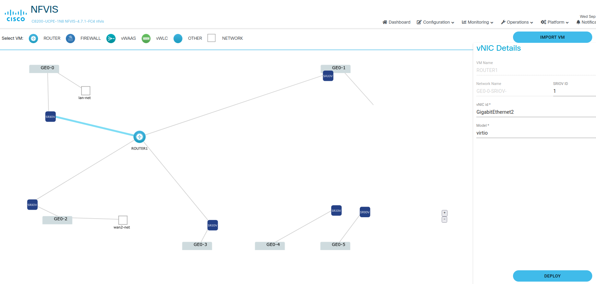
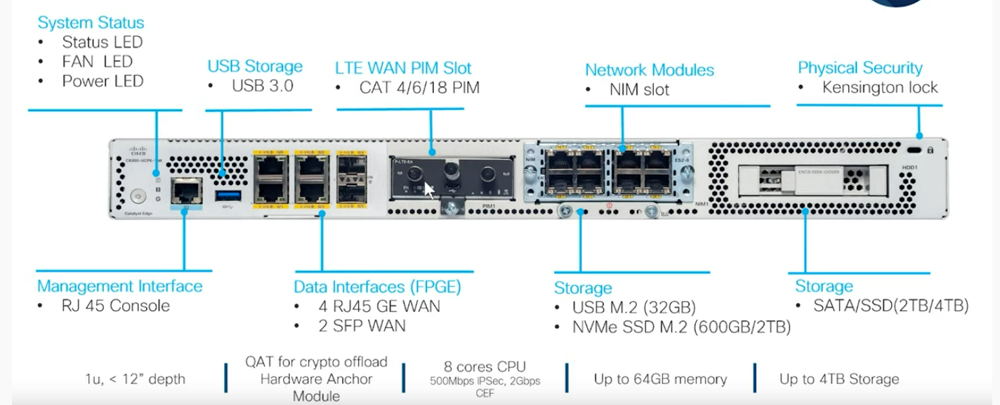
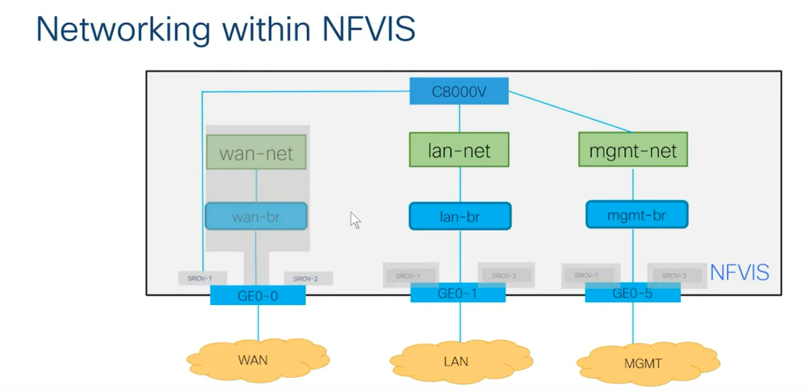
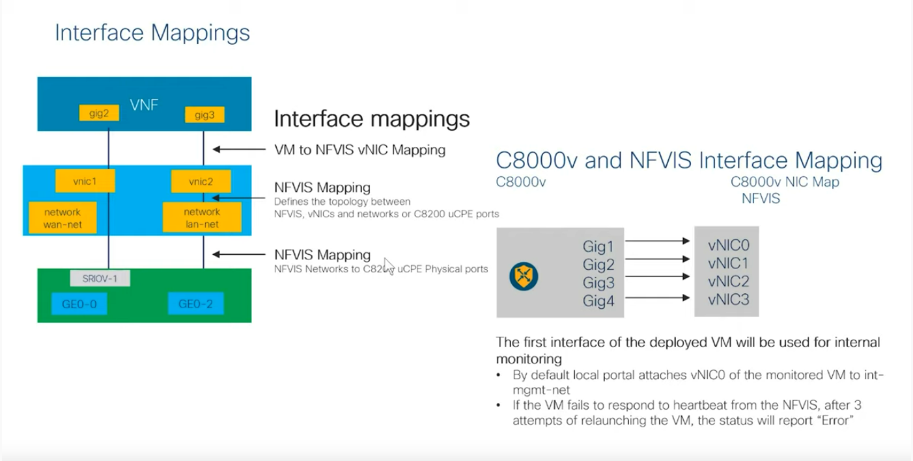

<!-- backgroundImage: url(images/blueteam1.png)-->

<h1> Présentation du Catalyst 8200 </h1>

---


<!-- backgroundImage: -->


# Catalyst 8200 définition par Cisco

<div style="text-align: left"> 

- Le système Cisco Catalyst 8200 Edge uCPE réunit des fonctions de _routage, de commutation, de stockage, de traitement_ et bien d'autres fonctions de calcul et de réseau dans une seule unité de rack compacte.
</div>

<div style="text-align: left"> 

- Le **Cisco Catalyst 8200** Edge uCPE prend en charge toutes ces fonctions en offrant une infrastructure pour le déploiement des fonctions de réseau virtualisées (VNF), tout en agissant comme un serveur qui résout des problèmes de traitement, de workload et de stockage."
</div>

<div style="text-align: right"> 
source Cisco 
</div>

---

<!-- backgroundImage: -->


# En fait

C'est un **"<span style="color:red ">boitier de virtualisation"</span>** dont le système d'exploitation NFVIS basé sur Linux et son hyperviseur KVM. Dans les dernières versions de NFVIS, Kubernetes fait son apparition.

- NFV = Network Function Virtualisation
- NFVIS = Cisco Enterprise NFV Infrastructure Software

Quand vous vous connectez via le port console, vous êtes sous NFVIS (user **admin** password par défaut **Admin123#**).

---
<!-- backgroundImage: -->


###### Interface WEB de NFVIS.



---

<!-- backgroundImage: -->


# C8200



---
<!-- backgroundImage: -->


###### Le réseau et le C8200




---

<!-- backgroundImage: -->


# C8200

- On définit des réseaux (wan-net, lan-net,mgmt-net...).
- Les réseaux sont reliés à des bridges (wan-br, lan-br,mgmt-br..).
- Les bridges sont reliés aux cartes réseaux physiques qui génèrent les "cartes SRIOV" auxquelles les VM peuvent se connecter directement (para-virtualisation).
- Les cartes réseaux physiques sont reliées aux différents LAN. 

---

<!-- backgroundImage: -->


### C8200 NFVIS configuration de base

```ios
nfvis(config)# system settings wan ip address 10.202.100.1 255.255.0.0
nfvis(config)# system settings default-gw 10.202.255.254
nfvis(config)# system settings hostname c8200-1
nfvis(config)# end
```
Des qu'une ip est configurée sur le management elle est répercutée sur lan-br et vice-versa


```ios
bridges bridge lan-br
ip address 192.168.88.10 255.255.255.0
port GE0-3
```

---

<!-- backgroundImage: -->


# Configurer l'accès SSH sur le C8200 


```ios
Device# configure terminal
Device(config)# aaa new-model
Device(config)# aaa authentication login default local
Device(config)# aaa authorization exec default local
Device(config)# username cisco privilege 15 secret cisco
Device(config)# ip ssh time-out 120
Device(config)# ip ssh authentication-retries 3
Device(config)# ip scp server enable
```

---

<!-- backgroundImage: -->


# Oui mais je veux mon routeur..

- Il est là sous forme d'une machine virtuelle. C'est le **"<span style="color:red "> C8000v </span>"**.
C'est une machine virtuelle qui se connecte au réseau via des bridges ou directement via **SRIOV** (la même technologie que les serveurs DELL que vous connaissez) pour des raisons de performances.Le "boitier" est livré vide, il vous faudra "uploader" et installer l'image. 
- L'OS de ce routeur est "**IOS XE**". C'est un kernel Linux qui supporte une application proche de l'IOS classique. L'intérêt est d'avoir les avantages de Linux (shell, utilitaires, processus indépendants..) et la syntaxe del'IOS classique. 

---

<!-- backgroundImage: -->


#### Mapping d'interfaces




---

<!-- backgroundImage: -->


# Connexions au routeur depuis NFVIS

```ios
## nfvis# show system deployments

## NAME ID STATE

ROUTER45 3 running

nfvis# vmConsole ROUTER45
Connected to domain ROUTER45
Escape character is ^\]

Router>en..
```

---

<!-- backgroundImage: -->


# Connexions au routeur depuis ssh

- port forwarding
```ios
ssh -p 2122 admin@192.168.1.203
```

- direct

```
ssh admin@192.168.1.204
```

CTRL shift 5 pour sortir de la console KVM

---

<!-- backgroundImage: -->


## Connexions aux cartes SRIOV


---

<!-- backgroundImage: -->


#  Commandes utiles

```ios
show vm_lifecycle opdata images
show running-config vm_lifecycle
```


Le 8000v est en mode autonome ou SD-WAN.

```ios
Router#sh ver | include mode
Router operating mode: Autonomous
```

---

# Upgrade de NFVIS
<!-- backgroundImage: -->


```ios
show system upgrade reg-info
show system upgrade

UPGRADE UPGRADE
NAME STATUS FROM TO

Cisco\_NFVIS\_Upgrade-4.6.2-FC3.nfvispkg IN-PROGRESS - -
system upgrade reg-info name Cisco\_NFVIS\_Upgrade-4.6.2-FC3.nfvispkg
location /data/upgrade/register/Cisco\_NFVIS\_Upgrade-4.6.2-FC3.nfvispkg
package-version 4.6.2-FC3
status Valid
upload-date 2022-09-06T13:51:46.775051-00:00
```

---

<!-- backgroundImage: -->


#  Correspondances des cartes Physiques et Virtuelles

```ios
interfaces interface 1
model virtio
network GE0-0-SRIOV-1
!
interfaces interface 2
model virtio
network GE0-1-SRIOV-1
!
...
```

---

<!-- backgroundImage: -->


#  Correspondances des cartes Physiques et Virtuelles

```ios
interfaces interface 1
model virtio
network GE0-0-SRIOV-1
nfvis# show system deployments
NAME ID STATE TYPE
ROUTER1 7 running vm

nfvis# vmConsole ROUTER1
Connected to domain ROUTER1
Escape character is ^\]
```

---

<!-- backgroundImage: -->


#  Sur le routeur

```
Router#sh ip interface brief
Interface IP-Address OK? Method Status Protocol
GigabitEthernet1 10.20.0.2 YES TFTP up up
GigabitEthernet2 unassigned YES unset up up => GE-0
GigabitEthernet3 unassigned YES unset up up => GE-1
GigabitEthernet4 unassigned YES unset up up => GE-2
GigabitEthernet5 unassigned YES unset up
```
