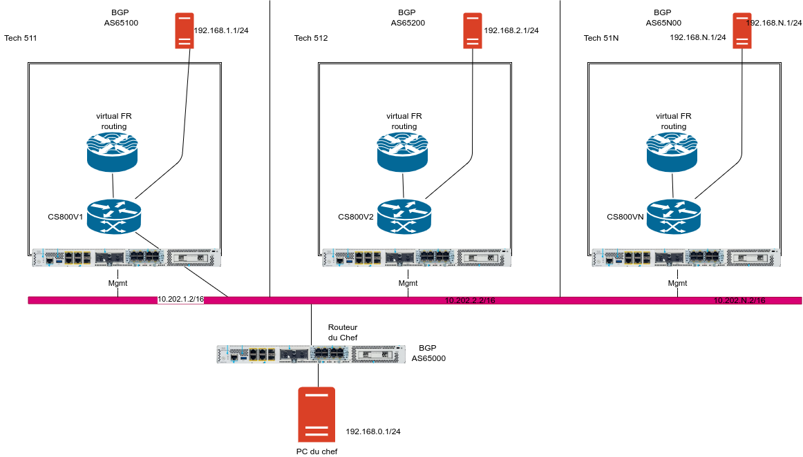

# Description de la SAE D03

## la situation professionnelle

Vous êtes technicien dans une équipe en charge des réseaux d'une grande entreprise.
L'entreprise gère un AS BGP privée pour chacune de ses filiales et vous êtes responsable d'une de ces AS.

Votre chef a décidé de virtualiser une partie de l'infrastructure réseau et a acheté des "edge routers" Catalyst 8200.
Vous suivez tout d'abord une formation sur le catalyst réalisé par votre responsable.
Une auto formation sur le management de ces routeurs IOX-XE (installation et exploitation de Yang d'un CRS1000V) vous est aussi demandée.
Après une formation vous "prendrez en main" ce boîtier de virtualisation et vous simulerez un Autonomous System (=1 filiale = 1 technicien) avant son déploiement en production.
Vous travaillerez donc individuellement.
Votre PC vous servira de station de travail pour vous connecter via SSH  à vos routeurs et tester que vous arrivez bien jusqu'au PC du chef et réciproquement.

Le schéma à réaliser est le suivant (vous êtes responsable d'un Catalyst 8200):
Il vous est demandé d'automatiser le déploiement de la solution avec Python (Nornir, Netmiko, napalm...) ainsi que le déploiement des machines virtuelles et des packages necessaires (bash, zsh...)

## Livrables attendus:

- Un document contenant le résultat de votre auto-formation (devops associate, installation du CSR100V et  TP sur YANG (Restconf , Netconf...). 
- Un document avec vos configurations et les preuves du bon fonctionnement de votre maquette: vous devez accéder à vos deux routeurs virtuels par ssh, pouvoir pinguer le PC du chef  et trouver au un autre technicien pour valider mutuellement vos deux maquettes (faire signer votre collègue pour une recette formelle).
- La validation réussie de votre maquette au plus tôt par votre chef (Le temps de mise en place de votre maquette influera sur votre évaluation de fin d'année pour votre augmentation de début d'année)
Pour les techniciens les plus avancées :
- Une transposition de ce que vous aurez appris sur le CSR1000v via la NetAcad de Cisco au C8000v sur la partie gestion de configuration. Il faudra vérifier que vous pouvez l'interroger via les protocoles Netconf et Restconf.

## ATTENTION
- LA PERTE du MOT de PASSE sur le Catalyst 8000  sera catastrophique pour votre évaluation professionnelle ! Un technicien doit être capable de noter un mot de passe et de tracer ses actions.
- Vous remettrez avant la fin de la SAE le Routeur dans son état initial et vous le ferez valider par votre responsable.

  

  

  
  

